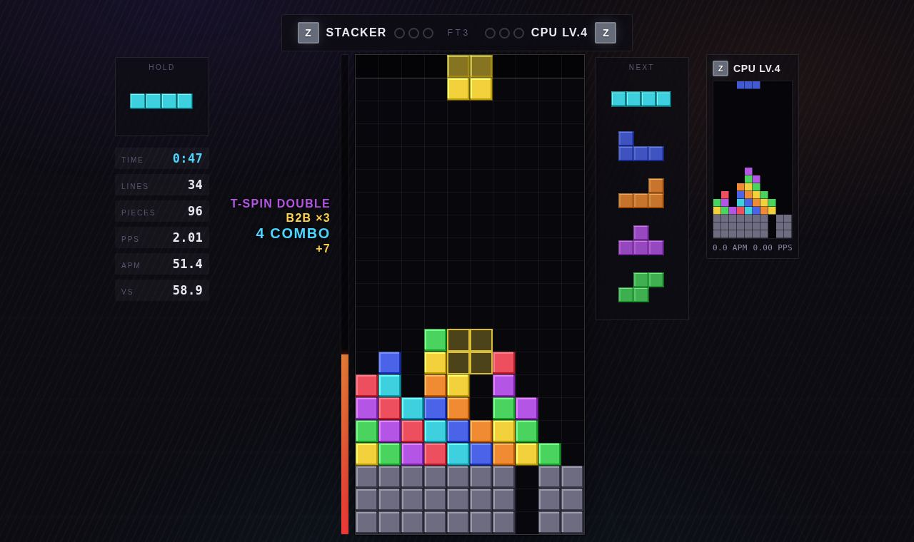
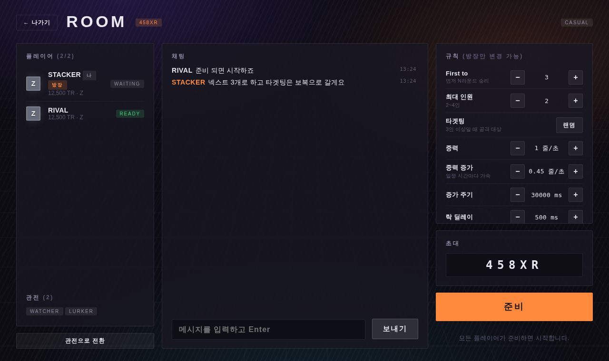
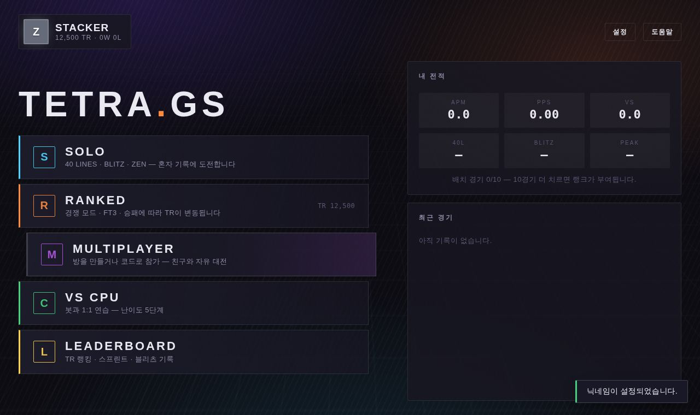
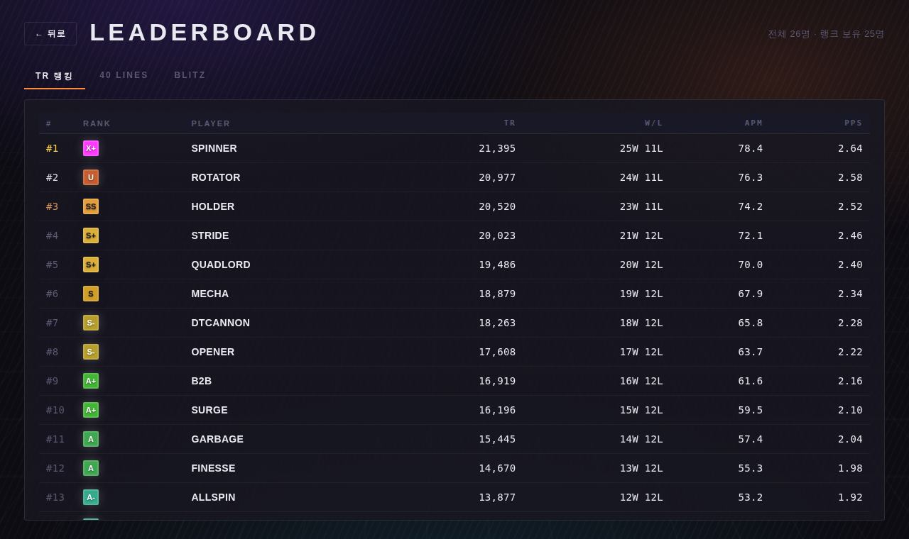
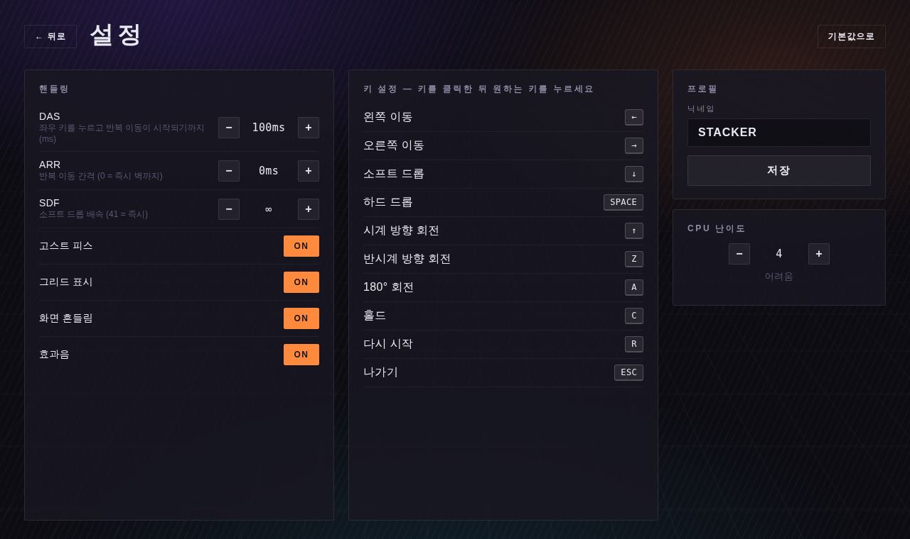

# TETRA.GS

Google Apps Script 위에서 도는 멀티플레이 테트리스입니다. TETR.IO를 참고해
가이드라인 규칙(SRS·7-bag·홀드·T-스핀), Glicko-2 기반 레이팅과 랭크,
가비지를 주고받는 경쟁 모드, 그리고 비슷한 결의 UI를 구현했습니다.

스프레드시트 하나가 데이터베이스이고, 웹앱 하나가 서버 겸 클라이언트입니다.
외부 서비스·서버·빌드 도구가 필요 없습니다.



<details>
<summary>다른 화면들</summary>






</details>

---

## 무엇이 들어 있나

| | |
|---|---|
| **경쟁 (Ranked)** | TR 기반 매칭 → FT3 → Glicko-2로 레이팅 정산. 10경기 배치 후 D ~ X+ 랭크 부여 |
| **멀티플레이** | 방 만들기 / 코드로 참가 / 공개 방 목록. 2~4인, 방장이 14가지 규칙 조정 |
| **관전** | 아무 방이나 관전 입장. 꽉 찼거나 경기 중이면 자동으로 관전이 됩니다 |
| **채팅** | 방 안에서 플레이어·관전자 모두 대화. 경기 중에는 토스트로 표시 |
| **타겟팅** | 3인 이상 전투에서 랜덤 / 균등 / 보복 / 1위 집중 중 선택 |
| **VS CPU** | 5단계 난이도의 휴리스틱 봇과 1:1 (약 7 APM ~ 38 APM) |
| **솔로** | 40 LINES(스프린트) · BLITZ(2분 점수) · ZEN(무한) |
| **랭킹** | TR 래더 · 스프린트 · 블리츠 기록판 |
| **설정** | DAS / ARR / SDF 핸들링, 키 재설정, 고스트·그리드·화면흔들림·효과음 |

게임플레이는 SRS 회전과 월킥(180° 회전 포함), 7-bag, 홀드, 고스트 피스,
락 딜레이(무브 리셋 15회), T-스핀 및 미니 판정, 퍼펙트 클리어, 콤보,
백투백, 가비지 상쇄와 지연 입력까지 갖추고 있습니다.

---

## 설치

### 방법 A — clasp (권장)

```bash
npm install -g @google/clasp
clasp login
clasp create --type webapp --title "TETRA.GS" --rootDir src
# 생성된 .clasp.json 의 rootDir 이 "src" 인지 확인
clasp push
clasp deploy
```

### 방법 B — 수동

1. <https://script.google.com> 에서 새 프로젝트를 만듭니다.
2. 프로젝트 설정에서 **"appsscript.json 매니페스트 파일 표시"** 를 켭니다.
3. `src/` 안의 파일을 같은 이름으로 하나씩 붙여넣습니다.
   - `.gs` 파일 → 스크립트 파일
   - `.html` 파일 → HTML 파일 (이름에서 `.html` 은 빼고 입력)
   - `appsscript.json` → 매니페스트에 덮어쓰기

### 배포 후 반드시 할 것

1. 편집기에서 **`setup`** 함수를 한 번 실행합니다.
   데이터베이스 스프레드시트가 자동으로 만들어지고, 실행 로그에 URL이 찍힙니다.
2. **`installTriggers`** 를 한 번 실행합니다. (10분마다 죽은 방·대기열을 청소)
3. **배포 → 새 배포 → 웹 앱** 으로 배포합니다.
   - 실행 계정: **나** (모든 플레이어가 같은 DB를 써야 하므로 필수)
   - 액세스 권한: **모든 사용자**
4. 발급된 `/exec` URL을 플레이어에게 공유합니다.

> `/dev` URL은 배포자 본인만 열 수 있습니다. 멀티플레이 테스트는 반드시
> `/exec` URL로 하세요.

---

## 조작

| 동작 | 기본 키 |
|---|---|
| 이동 | `←` `→` |
| 소프트 드롭 | `↓` |
| 하드 드롭 | `Space` |
| 시계 방향 회전 | `↑` 또는 `X` |
| 반시계 방향 회전 | `Z` 또는 `Ctrl` |
| 180° 회전 | `A` |
| 홀드 | `C` 또는 `Shift` |
| 다시 시작 (솔로) | `R` |
| 나가기 | `Esc` |

설정 화면에서 전부 다시 지정할 수 있습니다. 핸들링 기본값은 DAS 100ms /
ARR 0 / SDF 41(즉시)입니다.

---

## 레이팅

내부적으로는 **Glicko-2**(rating, RD, volatility)로 계산하고, 화면에는
TETR.IO와 같은 방식으로 유도한 **TR(0 ~ 25,000)** 을 보여줍니다.

```
TR = 25000 / (1 + 10^( (1500 - glicko) · π / √(3·ln10²·RD² + 2500·(64π² + 147·ln10²)) ))
```

- **경기 승패 하나만** 레이팅에 들어갑니다. 3-0이든 3-2든 결과는 같습니다.
  TETR.IO와 같은 방식이고, 이렇게 해야 "이겼는데 TR이 깎이는" 일이 없습니다.
  라운드별로 반영하면 라운드 승률 90%인 강자가 3-2로 이길 때 기대치 미달로
  판정돼 TR이 내려갑니다 — 수학적으로는 맞지만 게임으로는 틀렸습니다.
- RD가 큰 신규 플레이어는 초반에 TR이 크게 출렁이고, 경기를 거듭할수록
  변동폭이 줄어듭니다. 그리고 이길 확률이 낮았을수록 많이 오릅니다.

| 승리 시 TR 변화 | |
|---|---|
| 신규끼리 (RD 350) | **+3,250** |
| 정착끼리, 실력 동일 (RD 60) | +243 |
| 정착 1500이 1900을 이김 (업셋) | +449 |
| 정착 1900이 1500을 이김 (예상대로) | +26 |
- **10경기**를 마치기 전에는 랭크가 `Z`(미배치)입니다.
- 랭크는 고정 점수가 아니라 **래더 백분위**로 정해집니다. TETR.IO와 같은
  방식이라, 같은 TR이라도 전체 분포에 따라 랭크가 달라집니다.
  (플레이어가 20명 미만이면 백분위가 의미 없으므로 고정 TR 구간으로 대체합니다.)

| 랭크 | 상위 | 랭크 | 상위 | 랭크 | 상위 |
|---|---|---|---|---|---|
| X+ | 0.1% | S+ | 17% | C+ | 84% |
| X | 1% | S | 23% | C | 90% |
| U | 5% | S− | 30% | C− | 95% |
| SS | 11% | A+ | 38% | D+ | 97.5% |
| | | A | 46% | D | 나머지 |
| | | A− | 54% | | |
| | | B+ / B / B− | 62 / 70 / 78% | | |

---

## 공격 테이블

`src/js_attack.html` 의 `ATTACK_TABLE` 한 곳에 모여 있습니다.

| 클리어 | 전송 |
|---|---|
| 싱글 / 더블 / 트리플 / 퀴드 | 0 / 1 / 2 / 4 |
| T-스핀 싱글 / 더블 / 트리플 | 2 / 4 / 6 |
| T-스핀 미니 싱글 / 더블 | 0 / 1 |
| 퍼펙트 클리어 | +10 |
| 백투백 | +1, 3연속부터 `floor(ln(1 + 0.8n))` 추가 |
| 콤보 | `×(1 + 0.25n)`, 3콤보 이상은 `ln(1 + 1.25n)` 하한 |

가비지는 도착 후 **500ms** 뒤부터 삽입되고, 그 사이에 보낸 공격으로
상쇄할 수 있습니다. 한 번 착지에 최대 8줄까지 올라옵니다.

---

## 방 규칙과 타겟팅

방장은 대기실에서 14가지를 조정할 수 있고, 방 안 모두에게 그대로 적용됩니다.
값은 서버에서 범위 검증을 거치므로 클라이언트가 임의 값을 밀어넣을 수 없습니다.

| 항목 | 범위 | 기본 |
|---|---|---|
| First to | 1 ~ 9 | 3 |
| 최대 인원 | 2 ~ 4 | 2 |
| 타겟팅 | 랜덤 / 균등 / 보복 / 1위 집중 | 랜덤 |
| 중력 | 0.1 ~ 20 줄/초 | 1 |
| 중력 증가 · 증가 주기 | 0 ~ 5 줄/초 · 5초 ~ 5분 | 0.45 · 30초 |
| 락 딜레이 · 무브 리셋 | 100 ~ 3000ms · 0 ~ 30회 | 500ms · 15회 |
| 넥스트 개수 | 1 ~ 6 | 5 |
| 홀드 허용 | ON / OFF | ON |
| 가비지 배율 · 지연 · 상한 | 0 ~ 5× · 0 ~ 5000ms · 1 ~ 40줄 | 1× · 500ms · 8줄 |
| 구멍 유지 확률 | 0 ~ 1 | 0.65 |

**타겟팅**은 3인 이상일 때만 의미가 있습니다(1:1은 넷 다 같은 동작).

- **랜덤** — 살아 있는 상대 중 무작위
- **균등** — 이번 라운드에 가장 적게 보낸 상대
- **보복** — 나를 가장 최근에 때린 상대
- **1위 집중** — KO가 가장 많은 상대

KO는 "마지막으로 나에게 가비지를 보낸 사람"에게 귀속되고, 자멸은 누구의
KO도 아닙니다. 마지막으로 공격한 상대의 보드는 주황색 테두리로 표시됩니다.
동점이면 매번 무작위로 갈라, 한 명만 계속 두들겨 맞지 않게 했습니다.

---

## 동작 원리

Apps Script에는 WebSocket이 없습니다. 그래서 이렇게 우회했습니다.

**① 폴링 한 번에 왕복 한 번**
경기 중 클라이언트는 약 320ms마다 `sync()` 를 한 번 호출합니다. 이 호출이
자기 상태를 쓰고 상대 상태를 함께 받아옵니다. 호출을 쪼개지 않는 이유는
Apps Script 왕복이 150~500ms이기 때문입니다. 이전 요청이 아직 안 왔으면
다음 요청은 건너뜁니다.

**② 각자 자기 키만 쓴다**
플레이어별 상태는 `rs:<방코드>:<플레이어ID>` 키에 저장하고, 그 키는 본인만
씁니다. 덕분에 상태 전송 경로에는 락이 전혀 없습니다.

**③ 상태 전이는 서버가 소유한다**
대기 → 카운트다운 → 진행 → 라운드 종료 → 경기 종료의 판단은 서버가 합니다.
두 클라이언트 모두 `sync()` 로 이 판정을 돌리지만, 실제 전이는 짧은 락
안에서 멱등하게 일어납니다. 먼저 도착한 쪽이 전이를 수행하고 다른 쪽은
결과만 봅니다. 락이 잡혀 있으면 그냥 건너뛰고 다음 틱에 처리합니다.

**④ 피스 순서는 보내지 않는다**
라운드마다 서버가 시드를 발급하고, 두 클라이언트가 같은 시드로 같은
7-bag을 생성합니다. 피스 큐는 네트워크를 타지 않습니다.

**⑤ 공격은 누적 로그로 보낸다**
공격 이벤트에는 증가하는 번호가 붙고, 클라이언트는 최근 24개를 매번
통째로 보냅니다. 받는 쪽은 아직 적용하지 않은 번호만 처리합니다. 동기화가
한두 번 실패해도 공격이 유실되지 않습니다.

**⑥ 관전과 채팅**
관전자는 좌석이 없어 상태를 쓰지 않고 읽기만 합니다. 준비 판정과 생존자
집계에서도 빠지므로 몇 명이 보든 경기에 영향이 없습니다. 채팅은 방 객체에
최근 40개만 남고, 클라이언트가 마지막으로 받은 번호를 보내면 그 이후 것만
돌려줍니다. 도배는 0.7초 간격 제한과 200자 상한으로 막습니다.

**⑦ 저장소는 두 층**
- `CacheService` — 방, 플레이어 상태, 매칭 대기열 (빠름, 6시간 후 만료)
- 스프레드시트 — 계정, 레이팅, 전적 (느리지만 영구적이고 사람이 읽을 수 있음)

### 한계

- **지연**: 상대 보드는 초당 3회 정도 갱신됩니다. 가비지도 그만큼 늦게
  도착합니다. 같은 방에서 겨루기에는 충분하지만 프레임 단위 경합은 안 됩니다.
- **관전도 같은 폴링을 씁니다.** 초당 1회 남짓 갱신되므로 흐름을 보기에는
  충분하지만 리플레이 수준의 재생은 아닙니다.
- **동시 접속**: Apps Script 실행 할당량에 묶입니다. 소규모(수십 명) 기준
  설계이며, 대회 규모 트래픽에는 맞지 않습니다.
- **부정 방지 없음**: 시뮬레이션은 전적으로 클라이언트에서 돌아갑니다.
  서버는 클라이언트가 보고한 결과를 그대로 믿습니다. 지인끼리 하는 용도로
  보시고, 랭킹을 진지하게 쓰려면 서버 측 검증이 필요합니다.
- 방과 대기열은 `CacheService`에 있으므로 캐시가 비워지면 사라집니다.
  계정·레이팅·전적은 스프레드시트에 있어 영향받지 않습니다.

---

## 파일 구조

```
src/
  appsscript.json     매니페스트 (V8, 웹앱 설정, OAuth 범위)

  Code.gs             doGet / RPC 디스패처 / setup / 트리거
  Store.gs            스프레드시트 + 캐시 + 재진입 가능한 락
  Glicko.gs           Glicko-2 및 TR 변환
  Ranks.gs            백분위 기반 랭크 산정
  Players.gs          계정, 프로필, 솔로 기록
  Rooms.gs            방 생애주기, 라운드 상태머신, sync()
  Matchmaking.gs      랭크 대기열과 페어링
  Leaderboard.gs      래더 및 기록판

  index.html          셸
  css.html            전체 스타일
  ui.html             화면 마크업
  js_util.html        시드 PRNG, DOM/포맷 헬퍼, 토스트, 모달
  js_engine.html      테트리스 엔진 (SRS, 7-bag, 락 딜레이, T-스핀, 가비지)
  js_attack.html      데미지 테이블과 점수 계산
  js_render.html      캔버스 렌더러
  js_input.html       DAS/ARR 입력과 키 설정
  js_ai.html          CPU 봇
  js_net.html         google.script.run 래퍼
  js_game.html        게임 루프, 모드, HUD, 대전 진행
  js_app.html         화면 전환과 메뉴

tests/                헤드리스 테스트 (src/ 를 직접 읽습니다)
docs/                 README 스크린샷
```

---

## 규칙 손보기

| 바꾸고 싶은 것 | 위치 |
|---|---|
| 공격량 | `js_attack.html` → `ATTACK_TABLE` |
| 중력, 락 딜레이, 가비지 지연/상한 | `js_game.html` → `rulesFor()` |
| 카운트다운·라운드 간격, 연결 끊김 판정 시간 | `Rooms.gs` → `ROOMS` |
| 방 규칙의 범위·기본값 | `Rooms.gs` → `ROOM_RULES` |
| 규칙 편집기의 라벨·증감폭 | `js_app.html` → `RULE_META` |
| 타겟팅 동작 | `js_game.html` → `pickTarget()` |
| 채팅 길이·보관 수·도배 제한 | `Rooms.gs` → `ROOMS` |
| 매칭 TR 허용폭, FT 수 | `Matchmaking.gs` → `MM` |
| 배치 경기 수, Glicko τ, RD 하한 | `Glicko.gs` → `GLICKO` |
| 랭크 백분위·색상 | `Ranks.gs` → `RANKS.LADDER` |
| CPU 난이도·성향 | `js_ai.html` → `AI_LEVELS`, `WEIGHTS` |

---

## 검증

`tests/` 에 헤드리스 테스트가 들어 있습니다. `src/` 의 파일을 그대로 읽으므로
사본이 어긋날 일이 없습니다.

```bash
cd tests
npm install          # Playwright (브라우저 스위트용)
npm test             # 전체
npm run test:fast    # 브라우저 없이 Node 스위트만
```

| 스위트 | 개수 | 대상 |
|---|---|---|
| `engine` | 27 | 7-bag 균등성, SRS 회전 사이클과 벽 충돌, 라인 클리어와 행 압축, T-스핀 코너 규칙과 실제 TSD, 공격 테이블, 가비지 삽입·상쇄·상한·지연, 탑아웃과 Zen, 직렬화, 봇 300피스 완주 |
| `rating` | 14 | Glickman(2013) 논문 예제 대조 (1464.06 / 151.52 / 0.05999), RD 수렴, 업셋 보상, TR 단조성, **이긴 쪽이 레이팅을 잃지 않음** |
| `server` | 43 | 계정과 토큰, 매칭 페어링과 밴드 확장, 방 상태머신, 연결 끊김, 공격 릴레이와 로그 상한, FT3 정산 1회성, 재대결 방지·허용, 방 권한과 정원, 백분위 랭크, **관전 입·퇴장과 좌석 전환, 채팅 전달·도배 제한·이스케이프, 규칙 범위 검증, KO 귀속** |
| `template` | 8 | `doGet` 이 만드는 페이지를 HtmlService 와 같은 규칙으로 렌더링해 검사 — 스크립틀릿 잔여물, include 해석과 순서, 모든 `<script>` 블록의 파싱(= `<?= ?>` 이스케이프로 JS가 깨지는 사고 차단), 매니페스트, 클라이언트/서버 RPC 목록 일치 |
| `browser` | 36 | 실제 Chromium에서 부팅 → 40 LINES 완주 → CPU 대전 → 랭킹·설정·키 리바인드 → 방 생성, **규칙 편집기·채팅·타겟팅 4종**, 무오류 확인 |
| `online` | 26 | 탭 **세 개**가 공유 백엔드로 실제 대전: 시드 일치, 가비지 전달, 라운드 판정, 경기 전체 통계, TR 정산, **관전자가 두 보드를 보고 채팅에 참여** |

배포 없이 대전을 확인하고 싶다면 `node tests/serve.js` 를 띄우고 출력된
포트를 브라우저 탭 두 개로 열면 됩니다.
